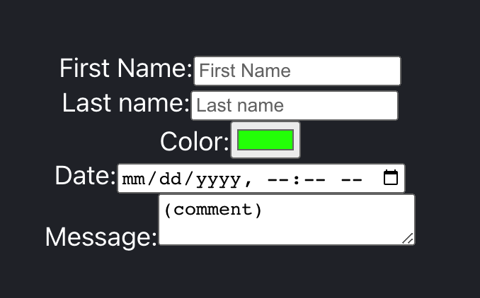

# Form Practice - React.js App
Building a React App with onChange functionality for HTML form.

[](https://form-practice-vdf.web.app)


## Demo link
[See Link](https://form-practice-vdf.web.app)

## Covered in Class
* onChange
* Form Element
* Controlled Components

## Basic Code
```
<label>First Name:
<input type="text">
</label>

